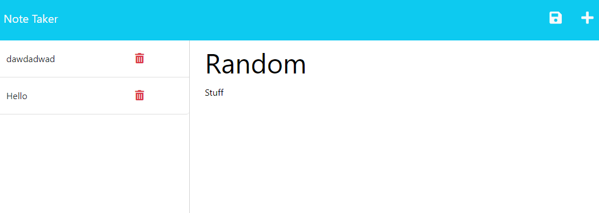
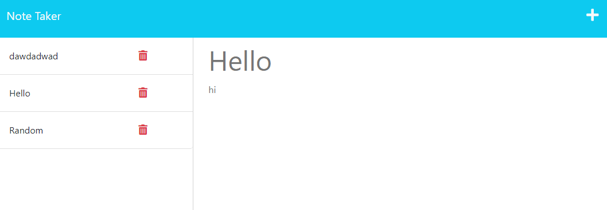
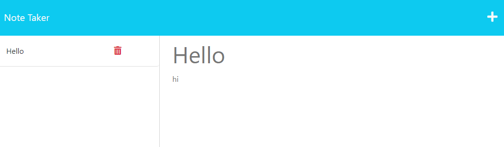
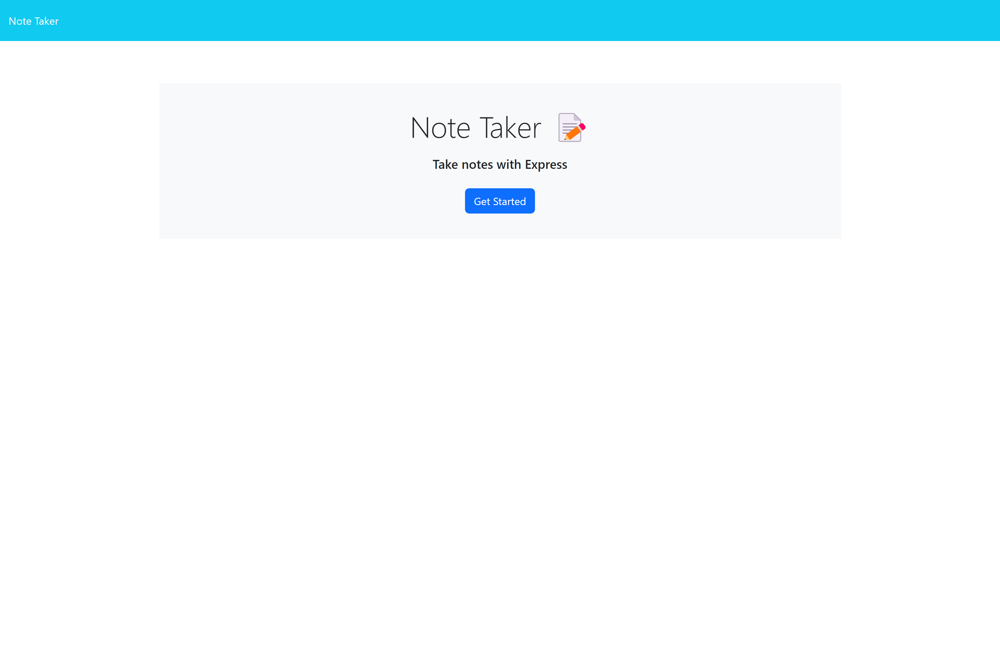
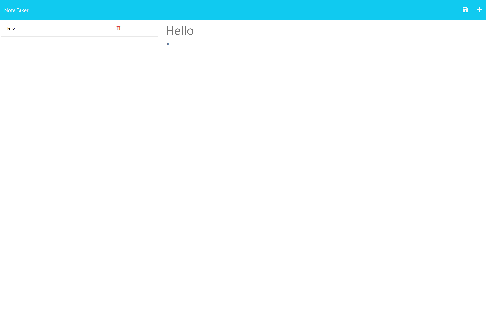

# Notes

## Badges

## Description

- Motivation: my motivation for this project was to create a program that allows me to keep track of tasks or notes for the future
- Goal: i build this project to be able to further my knowleadge in express.js and put what i already knew to the test
- Problems Solved: the problems it solves for me and i hope for others is to have your thoughts or tasked be placed in an organized matter
- What I Learned: The things i learned from this program is how use the get and post functions accodingly, they were topics we went over but to have a challenge like this that actually test my knowleadge was nice to be able to see if i cant put what i was taught into practice.

## Installation

- node.js
- express

## Usage

## Credits

N/A

## License

This program is done under the license: [MIT License](https://choosealicense.com/licenses/mit/)

## How To Contribute

## Questions

GitHub: https://github.com/Albikras

If you want to reach me with additional question click my email link here: Krasniqi1287@gmail.com

## Links

Github: https://github.com/Albikras/Notes,
Heroku: https://notescreator.herokuapp.com

## Screenshot

## Video

https://github.com/Albikras/Notes/assets/124819029/8ce6d41f-b932-4c4a-9c6f-e40d982833e9

